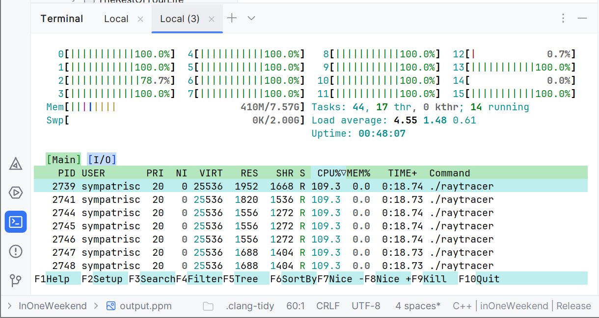
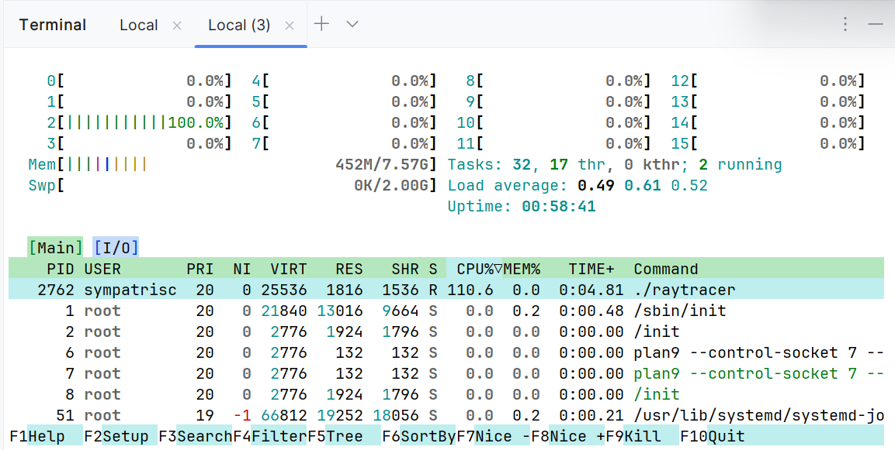

## a) Machen Sie sich mit den relevanten Teilen des Quellcodes des Raytracers vertraut. Dies sind insbesondere die Dateien camera.h und color.h im Verzeichnis src/InOneWeekend.

## Zusammenfassung: `camera.h`

### Zweck der Datei

Die Datei `camera.h` definiert eine **Kameraklasse**, die:
- die Position und Blickrichtung der Kamera im 3D-Raum beschreibt,
- Strahlen (`rays`) durch jedes Pixel des Bildes erzeugt,
- und daraus ein gerendertes Bild im **PPM-Format** erzeugt.

Die Kamera unterstützt:
- **Anti-Aliasing** (mehrere zufällige Samples pro Pixel),
- **Tiefenschärfe/Unschärfe** (Defokus-Effekt),
- **Hintergrundfarbverlauf**, wenn Strahlen nichts treffen.

---

### Aufbau der Klasse `camera`

### Öffentliche Eigenschaften (`public`)
- `aspect_ratio` — Bildseitenverhältnis (z. B. 16:9)
- `image_width` — Bildbreite in Pixeln
- `samples_per_pixel` — Strahlen pro Pixel (Anti-Aliasing)
- `max_depth` — maximale Anzahl Lichtreflexionen (Bounces)
- `vfov` — vertikaler Sichtwinkel
- `lookfrom` / `lookat` — Kamera-Position und Zielpunkt
- `vup` — "Oben"-Vektor der Kamera
- `defocus_angle` — Winkel für Tiefenschärfe
- `focus_dist` — Fokusdistanz

### Wichtige öffentliche Methode
- **`render(const hittable& world)`**:  
  Erzeugt das fertige Bild:
    - Initialisiert interne Werte (`initialize()`)
    - Iteriert durch alle Pixel
    - Schickt pro Pixel mehrere Strahlen
    - Bestimmt für jeden Strahl die Farbe (`ray_color`)
    - Schreibt die Farben ins PPM-Format

---

### Interne Berechnungen (`private`)

### Interne Variablen
- Bildhöhe, Pixeldeltas (Größe eines Pixels im Raum)
- Kamerakoordinatensystem (Vektoren `u`, `v`, `w`)
- Position der oberen linken Ecke des Bildes
- Defokus-Scheibenberechnung für Unschärfe

### Wichtige interne Methoden
- **`initialize()`** — Bereitet Kameraposition, Pixelgrößen und Fokus vor
- **`get_ray(i, j)`** — Erzeugt für Pixel `(i,j)` einen Strahl mit leichter Zufallsabweichung
- **`sample_square()`** — Zufällige Verschiebung innerhalb eines Pixels (für Anti-Aliasing)
- **`defocus_disk_sample()`** — Zufälliger Punkt auf der Defokus-Scheibe (bei Unschärfe)
- **`ray_color(ray, depth, world)`** — Berechnet die sichtbare Farbe entlang eines Strahls

---

## Kurz zusammengefasst

> `camera.h` stellt eine virtuelle Kamera dar, die zufällige Strahlen durch jedes Pixel der Bildfläche erzeugt, mit realistischer Lichtberechnung (inklusive Anti-Aliasing und optionaler Tiefenschärfe).

---

## Zusammenfassung: `color.h`

`color.h` definiert, wie Farben im Raytracer gespeichert, verarbeitet und ausgegeben werden.

- Eine Farbe ist ein `vec3`-Vektor (r, g, b).
- `linear_to_gamma()` sorgt für realistische Helligkeit durch Gamma-Korrektur.
- `write_color()` schreibt Farben in 0–255 Bytewerte ins PPM-Bild.
- Werte werden auf [0.0, 0.999] begrenzt und dann auf 0–255 skaliert.

> Kurz: `color.h` wandelt interne Farbwerte in echte Bildpixel um und sorgt dafür, dass das Bild korrekt dargestellt wird.

---

###  b) Überlegen Sie sich, wie die Raytracer-Berechnung auf n Prozesse aufgeteilt werden kann.
Die Berechnung kann auf n Prozesse aufgeteilt werden, indem das Bild in Zeilenbereiche
(Scanlines) unterteilt wird. Dadurch kann die Bildberechnung parallelisiert und auf mehrere
CPU-Kerne verteilt werden.

### c) Modifizieren Sie den Quellcode so, dass ein paralleler Raytracer entsteht. Dabei können Sie wie folgt vorgehen:
1. `renderLine()` extrahieren und Parameterübergabe
- Alle wichtigen Parameter werden explizit als Argumente übergeben.
2. Farbwerte in ein gemeinsames Array schreiben, `mmap` verwenden
- Speicher wird mit mmap() angelegt, Farbwerte werden nicht mehr direkt ausgegeben, sondern in `rendered_image[...]` gespeichert
3. Kindprozesse anlegen, nicht-überlappende Bildteile berechnen
- Wir erzeugen Prozesse mit `fork()`, jeder Prozess bekommt einen eigenen `start_row` und `end_row` (keine Überlappung), kein doppeltes Rechnen
4. Elternprozess wartet und gibt danach das Bild aus
- Wartet mit `wait()`, danach wird das PPM-Format ausgegeben

### d) Testen Sie Ihr Programm und ermitteln Sie die Beschleunigung, die im Vergleich zur sequentiellen Version erreicht werden kann. Wählen Sie dabei für die parallele Version die Anzahl der Kindprozesse so, dass sie der Anzahl der Kerne Ihres Rechners entspricht. Beobachten Sie die Auslastung Ihres Rechners während der Raytracing-Berechnung. Wieso fällt diese gegen Ende der Berechnung ab und wie könnte dies vermieden werden?

Wie viele Kerne hat mein Rechner?

**WSL Terminal**: ``nproc`` -> 16

**Kompilieren**: `g++ -std=c++17 -o raytracer main.cc`

**Starten (mit Zeit)**: `time ./raytracer > output.ppm`

**Bild Anzeigen**: `displas output.ppm`

## Parallelisierung (16 Kerne)

**Zeit**:
`real    0m34.101s
user    6m49.620s
sys     0m0.278s`
Das Bild war nach 34s fertig gerendert.

## Sequentiell (1 Kern)

**Zeit**:
`real    3m8.720s
user    3m8.366s
sys     0m0.093s`
Das Bild war nach 3min 8s fertig gerendert.

## Beschleunigung:
Beschleunigungsfaktor = (serielle Zeit) / (parallele Zeit)
**Beschleunigung** = 188s / 34s ≈ 5,53

Mein Programm läuft etwa **5,5-mal** schneller durch die Parallelisierung!

- Ideale Beschleunigung bei 16 Kernen? Theoretisch 16x schneller
- Meine gemessene Beschleunigung? Ca. 5,5x schneller
- Warum nicht 16x? Overhead durch Prozesse, nicht perfekte Lastverteilung, Hyperthreading (nicht echte Kerne), IO-Verzögerung usw.

### Beobachten Sie die Auslastung Ihres Rechners während der Raytracing-Berechnung. Wieso fällt diese gegen Ende der Berechnung ab und wie könnte dies vermieden werden?
Während der Berechnung sinkt die CPU-Auslastung gegen Ende, da einige Prozesse schneller fertig werden als andere. Dadurch werden CPU-Kerne inaktiv, bevor das gesamte Bild fertig ist.
Dieses Problem entsteht durch ungleichmäßige Lastverteilung (Load Imbalance) und könnte durch kleinere Arbeitspakete oder dynamische Aufgabenverteilung (z.B. Work Stealing) verringert werden.